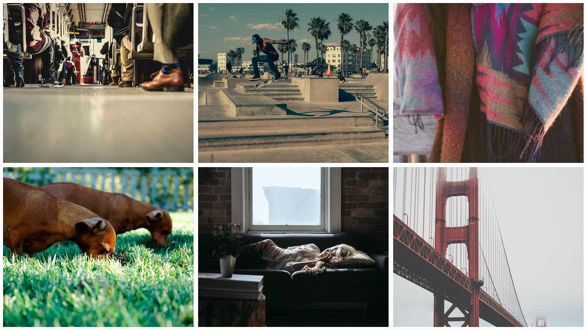
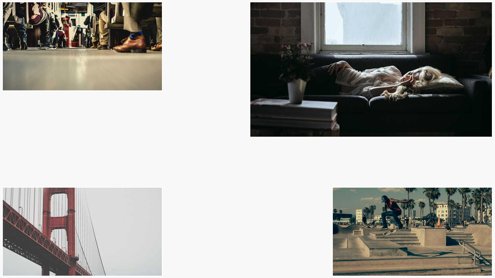
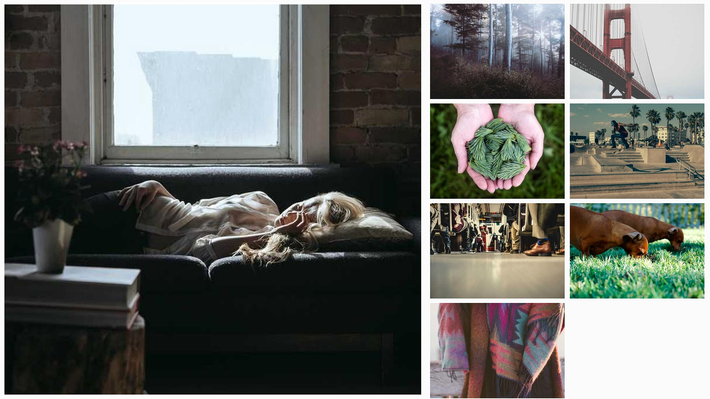

# Collage Maker

A Python-based tool that creates beautiful photo collages from a folder of images, inspired by the automatic collage features in Google Photos and Apple Photos.

## Features

- **4 Collage Styles**: Grid, Mosaic, Polaroid, and Magazine layouts
- **Advanced Caption Support**: Load captions from JSON or TXT files
- **Frame Options**: Apple/Google Photos-style frames (can be disabled)
- **Smart Image Cropping**: Intelligent resizing and cropping for perfect fits
- **High Quality Output**: Enhanced image quality with sharpening and optimization
- **Flexible Output**: Customizable dimensions and output formats
- **Sample Images**: Built-in sample image downloader with captions for testing
- **Command Line Interface**: Easy-to-use CLI with multiple options

## Installation

1. Clone the repository:
```bash
git clone https://github.com/nipunbatra/collage-maker.git
cd collage-maker
```

2. Install dependencies:
```bash
pip install -r requirements.txt
```

## Usage

### Basic Usage

Create a grid collage from images in a folder:
```bash
python collage_maker.py --folder /path/to/images
```

### Advanced Options

```bash
python collage_maker.py --folder /path/to/images --style all --width 1920 --height 1080 --output my_collage.jpg
```

### Command Line Options

- `--folder, -f`: Folder containing images (required)
- `--output, -o`: Output filename (default: collage.jpg)
- `--style, -s`: Collage style - grid, mosaic, polaroid, magazine, or all (default: grid)
- `--width, -w`: Output width in pixels (default: 1920)
- `--height, -h`: Output height in pixels (default: 1080)
- `--no-frames`: Disable frames on images (frames are enabled by default)
- `--download-samples`: Download sample images for testing

### Collage Styles

#### Grid Collage
Creates a neat grid layout with images arranged in rows and columns. Perfect for showcasing multiple photos with equal importance.



#### Mosaic Collage
Creates a dynamic mosaic with varying image sizes and positions. Uses advanced region-based placement algorithm for perfect space utilization with zero wasted space.



#### Polaroid Collage
Creates a nostalgic polaroid-style collage with rotated images and captions. Uses grid-based positioning with smart randomization for optimal space usage while maintaining authentic polaroid aesthetics.


#### Magazine Collage
Creates a magazine-style layout with a large featured image on the left and smaller images arranged in a grid on the right.




### Caption Support

The tool supports captions in multiple formats:

#### JSON Format (recommended)
Create a `captions.json` file in your image folder:
```json
{
  "photo1.jpg": "Beautiful sunset over the mountains",
  "photo2.jpg": "Family gathering at the beach",
  "photo3.jpg": "Morning coffee and newspaper"
}
```

#### TXT Format
Create a `captions.txt` file in your image folder:
```
photo1.jpg: Beautiful sunset over the mountains
photo2.jpg: Family gathering at the beach
photo3.jpg: Morning coffee and newspaper
```

#### Automatic Caption Extraction
If no caption file is found, captions are automatically extracted from filenames:
- `my_summer_vacation.jpg` → `My Summer Vacation`
- `beach-sunset-2023.jpg` → `Beach Sunset 2023`

### Sample Images

To download sample images with captions for testing:
```bash
python collage_maker.py --download-samples
```

This creates a `sample_images` folder with 8 sample images and a `captions.json` file with beautiful captions.

## Examples

### Create all collage styles:
```bash
python collage_maker.py --folder sample_images --style all
```
This generates:
- `collage_grid.jpg`
- `collage_mosaic.jpg`
- `collage_polaroid.jpg`
- `collage_magazine.jpg`

### Create a high-resolution magazine-style collage:
```bash
python collage_maker.py --folder my_photos --style magazine --width 2560 --height 1440
```

### Create collages without frames:
```bash
python collage_maker.py --folder my_photos --style all --no-frames
```

## Technical Features

### Frame System
- **Apple/Google Photos-style frames**: Subtle white borders that enhance image presentation
- **Adaptive frame sizing**: Different frame widths for different collage styles
- **Optional frames**: Can be disabled with `--no-frames` flag

### Smart Image Processing
- **Intelligent cropping**: Maintains aspect ratios while fitting images perfectly
- **Quality enhancement**: Automatic sharpening and optimization
- **Format support**: Works with all major image formats
- **High DPI output**: Supports custom resolutions up to 4K and beyond

### Advanced Layout Algorithms
- **Perfect space utilization**: Zero wasted space in mosaic layouts using region-based placement
- **Grid-based positioning**: Optimal placement in polaroid style with smart randomization
- **Collision detection**: Prevents image overlap through advanced algorithms
- **Proportional sizing**: Balances image sizes for maximum visual impact

## Supported Image Formats

- JPEG (.jpg, .jpeg)
- PNG (.png)
- BMP (.bmp)
- TIFF (.tiff)
- WebP (.webp)

## Requirements

- Python 3.7+
- Pillow (PIL) - Image processing
- Click - Command line interface
- Requests - Sample image downloading

## License

MIT License - feel free to use this tool for personal or commercial projects.

## Contributing

1. Fork the repository
2. Create a feature branch
3. Make your changes
4. Submit a pull request

## Inspiration

This tool was inspired by the automatic collage features in:
- Google Photos Memories
- Apple Photos Memories
- Instagram Story layouts
- Magazine and scrapbook designs

## Future Enhancements

- Web interface for easier use
- Video collage support
- Face detection for smart cropping
- Color theme matching
- Text overlay options
- Social media format presets
- Batch processing for multiple folders
- AI-powered layout suggestions

## Changelog

### Version 2.1.0
- **MAJOR IMPROVEMENT**: Perfect space utilization - zero wasted space in all layouts
- Advanced region-based mosaic algorithm for maximum space efficiency
- Grid-based polaroid positioning with smart randomization
- Enhanced magazine layout with optimized caption display
- Removed heart style to focus on core professional layouts
- Improved image quality with enhanced sharpening and contrast
- Better collision detection and placement algorithms

### Version 2.0.0
- Added Magazine collage style
- Implemented JSON/TXT caption support
- Added frame system like Apple/Google Photos
- Fixed whitespace issues in mosaic and polaroid styles
- Improved image quality with sharpening
- Enhanced collision detection algorithms
- Better space utilization in all layouts

### Version 1.0.0
- Initial release with Grid, Mosaic, and Polaroid styles
- Basic caption support from filenames
- Sample image download functionality